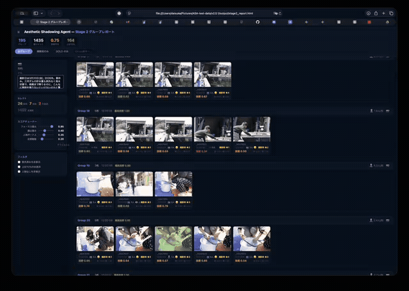

# SSS / 写真選別支援エージェント
## 思い切って連写していい。選ぶのはAIがやる。

**子供の表情は、連写でしか撮れない。でも、連写すると選ぶのが怖い——そのジレンマを解消するAIエージェント**

> 「この写真フォルダをセレクトして」——その一言で、あとは全部やっておきます。

---

## ハッカソン審査員の方へ（AGI Labo 2026-3）

**誰のどんな痛みを解決するか**: 子供の一瞬を逃したくなくて連写するたびに、選別地獄が待っている。2026年3月20日、子供と休日のお出かけで1435枚撮影した。家に帰って、PCを開いて——「あ、また選ばないといけない」。そのうち連写が怖くなる。撮ることより選ぶことが頭に浮かぶようになる。

**画面の前に座っていなければならない時間**: ユーザーが張り付く必要があるのは **約4〜10分**（撮影量に応じて自動算出した20〜50枚のサンプルレーティングのみ）。あとは席を立っていい。処理が終わったら戻ってくればいい。

**人間の介入は何回か**: **2回だけ**。①撮影意図を伝える、②代表カットにレーティングをつける。それ以外は放置でいい。

| 指標                                             | 旧設計       | 新設計        |
| ------------------------------------------------ | ------------ | ------------- |
| 画面の前に座っていなければならない時間（3000枚） | **2〜3時間** | **約4〜10分** |
| APIコール数                                      | 44,850回     | **3〜5回**    |
| ★3 recall（画像-画像モード）                     | 45%          | **82%**       |

※ v1.0.2（646枚・教師ラベルあり）で検証。正解=クライアント納品カット146枚（評価データセット上は★4ラベル）

**制約（正直に）**: Stage3の人間評価（約4〜10分）は必須。初回のみ `setup.sh` によるセットアップが必要。

### 評価基準別の対応

**自律性 (40%)**: `setup.sh` 不足時の環境構築提案、`rated_samples.json` からの中断再開、CLIPキーワード未機能時のフォールバック。撮影意図をAIからユーザーへ逆質問し、評価軸の文脈を自ら補完する。

**クオリティ (35%)**: ローカル処理（OpenCV/CLIP）とLLM（Claude）のハイブリッドアーキテクチャ。APIコスト99.99%削減。

**インパクト (25%)**: 「連写が怖い」という感覚を解放する。メディアが一杯になるまで撮っていい、という状態にする。Lightroom連携（XMPメタデータ）で明日から実際に使える。

---

## 何ができるか

子供と公園に行った。運動会があった。家族旅行から帰ってきた。

一瞬を逃したくなくて、バーストした。1435枚、手元にある。

でも——選別が終わるまで、家族はその写真を見られない。

SSS / 写真選別支援エージェント（開発コードネーム：Aesthetic Shadowing）は、その仕事を代行する。

| あなたがすること                                   | エージェントがすること                                                       |
| -------------------------------------------------- | ---------------------------------------------------------------------------- |
| `/photo-selector` と打つ                           | 撮影意図（運動会・お出かけ・旅行など）を確認する                             |
| 「子供の運動会です」と答える                       | 技術的失敗カット（完全白飛び・黒潰れ）を自動除外する                         |
| 20〜50枚にレーティングをつける（撮影量で自動算出） | その判断からあなたの審美眼を学習する                                         |
| 待つ                                               | 残り全カットを自律的に採点し、メタデータ（JPEG直接/RAWサイドカー）を書き出す |

**人間の関与時間：約4〜10分。**
撮影量に応じてサンプル数が自動調整されるが、それでも数分で終わる。

だから、思い切ってバーストしていい。メディアが一杯になるまで撮っていい。

---

## なぜこれが革新的か

### 「連写がこわい」という感覚を知っているか

子供のいい表情は、連写でしか撮れない。シングルショットではタイミングが合わない。わかっていても、連写を躊躇する。

理由は単純だ——選ぶのが怖い。撮れば撮るほど、後で苦しむことがわかっている。

このツールは、そのジレンマを解消する。**撮ることを楽しんでいい。選ぶのはAIがやる。**

### 従来のAI写真選別との違い

```
従来のAI
  技術品質（シャープネス・露出）のみで判定
  → 「ちゃんと撮れているが面白くない写真」を選ぶ
  → 写真家の感性は完全に無視される

SSS（Aesthetic Shadowing）
  技術スコア × 審美眼（学習済み） × 撮影意図（文脈）の三重評価
  → 「運動会なら躍動感を、お出かけなら笑顔を」と目的に応じて選ぶ
  → 写真家ごとの「好み」が蓄積され、精度が上がっていく
```

### スケーラビリティの革命

最初の設計（トーナメント方式）では、3000枚で**5.6時間、ユーザーが画面の前に張り付く必要があった**。
全カットの比較判定に立ち会い続けなければならない——これはエージェントではなく、人間を縛る装置だった。

設計を全面的に見直した。

```
旧設計: ユーザーが全対戦に立ち会う → 席を立てない時間が枚数 × 比例して増える
新設計: 代表20〜50枚をレーティングしてスタイルを学習 → あとは席を立っていい、AIが自律実行
```

| 指標                                             | 旧設計       | 新設計        |
| ------------------------------------------------ | ------------ | ------------- |
| 画面の前に座っていなければならない時間（3000枚） | **2〜3時間** | **約4〜10分** |
| APIコール数                                      | 44,850回     | 3〜5回        |
| コスト削減率                                     | —            | **99.99%**    |

### なぜ「自律性」にこだわるのか

このプロジェクトは、技術の問題ではなく**時間の問題**から生まれた。

エンジニアとして働きながら、子育てをしながら、写真を撮り続けている。
2026年3月20日、子供と休日のお出かけで1435枚撮った。帰宅後、PCを開いて気づいた——選別が終わるまで、家族はこの写真を見られない。その選別に費やす数時間は——家族と過ごせたはずの時間だ。

だから、人間を拘束するソリューションは、答えではない。

**自律性の具体例**

- 依存パッケージが不足していたら setup スクリプトの実行を提案し、環境を整えてから続行する
- Stage3 を途中で中断しても、次回起動時に `rated_samples.json` から続きを再開する
- Stage5 でキーワードが機能しない場合は `clip_query` のみにフォールバックして採点を続行する

---

## デモ（使い方）

```bash
# Claude Codeにインストール
/plugin marketplace add kaishushito/agi-lab-skills-marketplace
/plugin install aesthetic-shadowing@agi-lab-skills

# 起動（これだけ）
/aesthetic-shadowing:photo-selector
```

あとはClaudeが対話しながら全自動で進める。

---

## 技術的な仕組み

4ステージ構成のハイブリッドパイプライン。LLMを使うのは必要な場面だけ。

```
┌─────────────────────────────────────────────────────────────────┐
│  /photo-selector と打つ                                          │
└────────────────┬────────────────────────────────────────────────┘
                 │
                 ▼
┌─────────────────────────────────────────────────────────────────┐
│  Stage 0: 意図理解（LLM）                                        │
│  撮影シーンと目的を把握 → 選定基準のベースラインを構成             │
└────────────────┬────────────────────────────────────────────────┘
                 │
                 ▼
┌─────────────────────────────────────────────────────────────────┐
│  Stage 1: 技術フィルタ（ローカル・Python/OpenCV）                 │
│  ヒストグラムで完全白飛び（80%以上）・黒潰れ（80%以上）を検出     │
│  → 絶対に救済不能なカットのみ除外（除外率 0.3%）                  │
└────────────────┬────────────────────────────────────────────────┘
                 │
                 ▼
┌─────────────────────────────────────────────────────────────────┐
│  Stage 2: シーングループ化（ローカル・EXIF + pHash）              │
│  撮影時刻・視覚的類似度でシーンを塊として認識                     │
│  各カットに技術スコアを付与 → Stage3 サンプル選出の基準になる     │
└────────────────┬────────────────────────────────────────────────┘
                 │
                 ▼
┌─────────────────────────────────────────────────────────────────┐
│  Stage 3: 審美眼サンプリング（ユーザー参加）                       │
│  Stage2 の技術スコア上位カットを代表として選出                    │
│  20〜50枚にレーティング → Stage4〜5 に引き継がれる               │
└────────────────┬────────────────────────────────────────────────┘
                 │
                 ▼
┌─────────────────────────────────────────────────────────────────┐
│  Stage 4〜6: 全件自動採点 → 出力（Claude + ローカルCLIP）        │
│  Stage4: Claude が審美眼プロファイルを生成（APIキー不要）         │
│  Stage5: ローカルCLIPで全カットをスコアリング（APIコストゼロ）    │
│  Stage 6: メタデータ（XMP:Rating）書き出し (JPEG直接/RAWサイドカー)   │

└─────────────────────────────────────────────────────────────────┘
```

**Stage5 対比スコア（composite score）の仕組み**

高評価カットの特徴を足し、低評価カットの特徴を引く「対比スコア」で個人選好を反映する。

```
composite = 0.5 × CLIP類似度
          + 0.3 × 高評価キーワードとの平均類似度
          - 0.2 × 低評価キーワードとの平均類似度
```

この値をmin-max正規化で0〜1に変換し、★1〜★3にマッピングする。
キーワードが機能しない場合は `clip_query` のみにフォールバックして続行する。

**Stage3 サンプル数とカバレッジ**

サンプル数は固定値ではなく撮影量に応じて自動算出（全グループ数の10%基準、最小20枚・最大50枚）。
`--samples auto`（デフォルト）で自動算出される: 300グループ→30枚、100グループ→20枚、600グループ→50枚。

**Stage2 → Stage3 の設計**: Stage3 はランダムサンプリングではなく、Stage2 の技術スコアが最も高いカットをグループ代表として選出する。つまり「確実に判定できる写真」を人間が評価することで、残り全カットへの精度が上がる設計になっている。

アンカーが多いほど Stage5 `--mode image` の識別精度は上がる一方、人間の評価負担も増える。
撮影量・締切・用途に合わせて `--samples 数値` でオーバーライド可能。

**画像-画像モード（`--mode image`）**

テキストキーワードの代わりに、Stage3 で評価済みの画像そのものを視覚アンカーとして使うモード。
撮影者が実際に「好き」「嫌い」と判定したカットのCLIP特徴量を直接比較するため、言語化しにくい感性もそのままスコアに反映できる。

```
★3 recall（テキストモード）: 45%
★3 recall（画像-画像モード）: 82%
```
※ v1.0.2（646枚・教師ラベルあり）での検証。正解=クライアント納品カット146枚（評価データセット上は★4ラベル）

`rated_samples.json` が存在する場合は `--mode image` を推奨する。

**技術スタック**

- ローカル処理: Python, OpenCV, Rawpy, ExifTool, imagehash
- LLM: Claude（マルチモーダル）
- 出力: メタデータ（JPEG直接書き出し/RAWサイドカー生成）

---

> **補助スキル**: `chronicler` は開発ログから章を自動生成する補助スキル。
> 詳細は [`skills/chronicler/SKILL.md`](plugins/aesthetic-shadowing/skills/chronicler/SKILL.md) を参照。

---

## 開発ストーリー

2026年3月6日深夜、キックオフの熱が冷めないターミナルの前で、このプロジェクトは動き出した。

最初のコードは178行。動いた瞬間、ピンボケと判定された写真をRAWで開いてみると——本当にボケていた。「プログラムが人間の目を超えた」と気づいた瞬間だった。その後、グループ化アルゴリズムで286グループが38グループに収束し、トーナメント設計の致命的欠陥を発見し、全面的に設計を書き直した。

14日間、コードと格闘し続けた記録はここに残っている。

→ **[開発記録 MY_JOURNEY.md](plugins/aesthetic-shadowing/MY_JOURNEY.md)**

---

## Stage 2: セレクトUI

グループ化完了後、ブラウザダッシュボードが開く。技術スコア（eye_score / blur_score）をもとに連写グループが整理されており、キーボードだけで快適にセレクトできる。



セレクトが終わったら「📤 XMPに書き出す」ボタン一発で Lightroom 用に書き出し完了。

### Stage2で終わるか、Stage3以降に進むか

| モード | 向いている人 | 流れ |
|---|---|---|
| **手動セレクト**（Stage2止まり） | 自分でセレクトを楽しみたい。AIの下処理だけ借りたい | Stage2ダッシュボードでレーティング → 📤書き出し → Lightroom |
| **おまかせモード**（Stage3〜6） | 時間がない。全部AIに任せたい | 「おまかせ」と一言 → 代表カットを数分評価 → 自動採点 → Lightroom |

どちらのモードでも、Stage1〜2の技術スコアは引き継がれる。おまかせモードでも「全部AIが決める」ではなく、**あなたの審美眼をサンプリングしてから**残りを自動採点する設計になっている。

---

## 現在の実装状況

| Stage                       | 状態   | 説明                                                                   |
| --------------------------- | ------ | ---------------------------------------------------------------------- |
| Stage 0: 意図理解           | ✅ 完成 | セッション初期化・撮影コンテキスト把握                                 |
| Stage 1: 技術フィルタ       | ✅ 完成 | 完全白飛び・黒潰れのみ自動除外（除外率 0.3%）                          |
| Stage 2: グループ化 + セレクトUI | ✅ 完成 | シーン単位での時系列クラスタリング + ブラウザダッシュボードでセレクト |
| Stage 3: 審美眼サンプリング | ✅ 完成 | Stage2技術スコア上位カットを20〜50枚レーティング → Stage4〜5に引き継ぎ |
| Stage 4: プロファイル生成   | ✅ 完成 | Claude が直接実行（APIキー不要）                                       |
| Stage 5: CLIPスコアリング   | ✅ 完成 | ローカルCLIPで全カットをバッチ採点                                     |
| Stage 6: メタデータ書き出し | ✅ 完成 | JPEG直接/RAWサイドカーのハイブリッド方式                               |

---

## バッチ実行（スタンドアロン）

Claude Codeを使わず、コマンドラインで一括実行する場合は `run_pipeline.sh` を使う（`ANTHROPIC_API_KEY` 環境変数が必要）:

```bash
./run_pipeline.sh <jpeg_dir> <xmp_dir> <output_dir> [session.json]
```

Stage4 は `stage4/profile.py` を呼び出す（Claudeネイティブ実行の代替）。

---

## ロードマップ

- **ローカルLLM対応** — Ollama連携（オフライン・ゼロAPIコスト）
- **専用UI** — 審美眼学習フェーズのビジュアルインターフェース
- **マルチフォトグラファー対応** — ユーザーごとのスタイルプロファイル保存

---

## Repository Structure

```text
.claude-plugin/
└── marketplace.json

plugins/
├── aesthetic-shadowing/        ← このハッカソン作品
│   ├── .claude-plugin/
│   │   └── plugin.json
│   ├── skills/
│   │   ├── photo-selector/    ← メインスキル
│   │   │   └── SKILL.md
│   │   └── chronicler/        ← 補助スキル（開発ログ自動生成）
│   │       └── SKILL.md
│   ├── stage0/                ← セッション初期化
│   ├── stage1/                ← 技術フィルタ（.venv含む）
│   ├── stage2/                ← グループ化
│   ├── stage3/                ← 審美眼サンプリング
│   ├── stage4/                ← プロファイル生成（Claudeネイティブ）
│   ├── stage5/                ← CLIPバッチスコアリング
│   ├── stage6/                ← XMP書き出し
│   ├── run_pipeline.sh        ← バッチ実行（APIキー要）
│   └── MY_JOURNEY.md          ← 開発記録
└── terminal-vibes/
```

---

## おまけ: Chronicler スキルについて

このリポジトリには `/photo-selector` の他に `/chronicler` というスキルがある。

個人開発は孤独だ。壁にぶつかり、回り道をして、それでも諦めずに進む——その過程は、誰にも見えない。

Chronicler は、その軌跡を記録する。Git のコミット、エラーログ、試行錯誤の痕跡を読み解き、「今日の開発」を一人語りのドキュメンタリーとして `MY_JOURNEY.md` に書き継ぐ。

Andy Weir の作品——『火星の人』や『プロジェクト・ヘイル・メアリー』——が好きだ。主人公たちは孤立無援の状況でも、状況を記録し、仮説を立て、一手ずつ前に進む。そのトーンが好きで、自分の開発にも重ねたくなった。

「今日は何も進まなかった」と感じる夜に `/chronicler` を呼ぶ。すると、実際には何かが確かに積み上がっていたことを、物語として教えてくれる。

モチベーションを維持するための、小さな装置だ。

---

## License

MIT
